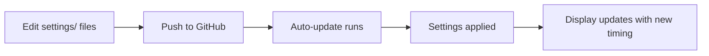

# 🎮 Remote Control Guide for Pregnancy Trackers

## Quick Reference: What You Can Control Remotely

### ✅ **EDITABLE Settings** (in `settings/` folder)
These files control tracker behavior and can be updated via GitHub:

| File | Purpose | What You Can Change |
|------|---------|-------------------|
| `settings/display_config.json` | Display timing | • Update frequency<br>• Screen switch interval<br>• Custom schedule times |
| `config.json` | Due date | • Expected birth date (per device) |

### 🚫 **DO NOT EDIT** (System Scripts)
These are operational scripts - don't modify for settings:

| File | Purpose |
|------|---------|
| `*.sh` files | System scripts for updates, monitoring, setup |
| `*.py` files | Core application code |

---

## 📊 Display Configuration Examples

### Change Update Frequency (settings/display_config.json)

**Every 5 minutes** (more frequent, shorter display life):
```json
{
  "display_update": {
    "enabled": true,
    "frequency_minutes": 5
  }
}
```

**Every 30 minutes** (less frequent, longer display life):
```json
{
  "display_update": {
    "enabled": true,
    "frequency_minutes": 30
  }
}
```

**Custom times only** (specific times of day):
```json
{
  "update_schedule": {
    "type": "custom",
    "custom_times": ["06:00", "12:00", "18:00", "22:00"]
  }
}
```

### Change Screen Switching Speed

**Faster switching** (every 10 minutes):
```json
{
  "screen_switching": {
    "enabled": true,
    "switch_interval_minutes": 10
  }
}
```

**Slower switching** (every hour):
```json
{
  "screen_switching": {
    "enabled": true,
    "switch_interval_minutes": 60
  }
}
```

---

## 🔄 How Remote Updates Work



1. **You edit** files in `settings/` folder
2. **Commit & push** to GitHub
3. **Trackers pull** updates automatically (every 12 hours by default)
4. **New settings** apply immediately
5. **Display timing** changes take effect

---

## 📱 Making Changes

### From GitHub Web:
1. Navigate to `settings/` folder
2. Click file to edit (e.g., `display_config.json`)
3. Click pencil icon to edit
4. Make changes
5. Commit with descriptive message

### From Command Line:
```bash
cd e-ink-pregnancy-tracker
vim settings/display_config.json
# Make your changes
git add settings/
git commit -m "Update display to refresh every 15 minutes"
git push
```

---

## 🔍 Monitoring Changes

SSH to any Pi and run:
```bash
# Check current settings
cat ~/e-ink-pregnancy-tracker/settings/display_config.json

# Monitor update status
bash ~/e-ink-pregnancy-tracker/monitor_updates.sh

# View update logs
tail -f ~/pregnancy-tracker-update.log

# Force immediate update
bash ~/e-ink-pregnancy-tracker/auto_update.sh
```

---

## ⚡ Common Scenarios

### "I want to preserve battery/display life"
Increase `frequency_minutes` to 30 or 60

### "I want to see changes more quickly"
Decrease `frequency_minutes` to 5

### "I want updates only at specific times"
Switch to `"type": "custom"` with your preferred times

### "I want to disable updates temporarily"
Set `"enabled": false` in display_config.json

---

## 📋 Settings Directory Structure
```
settings/
├── README.md              # This guide
├── display_config.json    # Display timing control
└── pregnancy.json.example # Template for due date
```

## ⚠️ Important Notes
- Changes apply to ALL connected trackers
- Allow 12 hours for automatic updates (or trigger manually)
- Test changes on one device first if possible
- Keep backups of working configurations